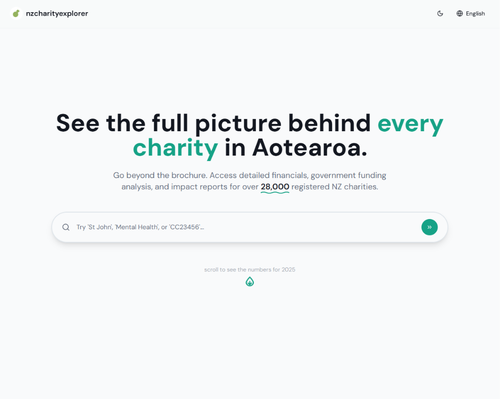
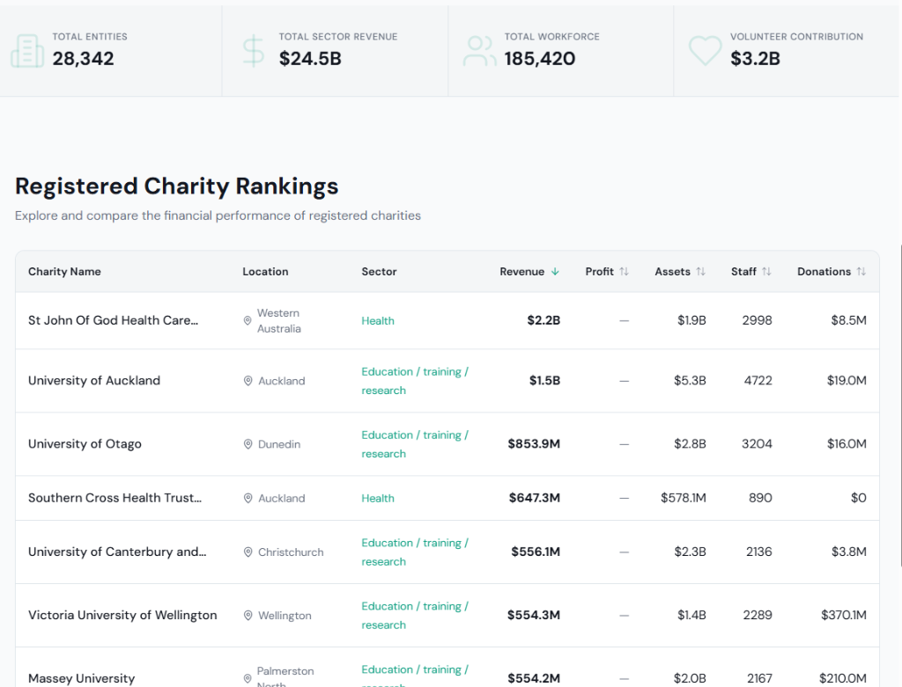
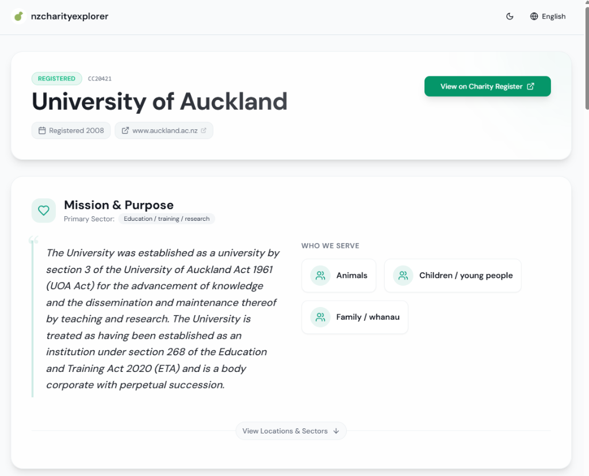
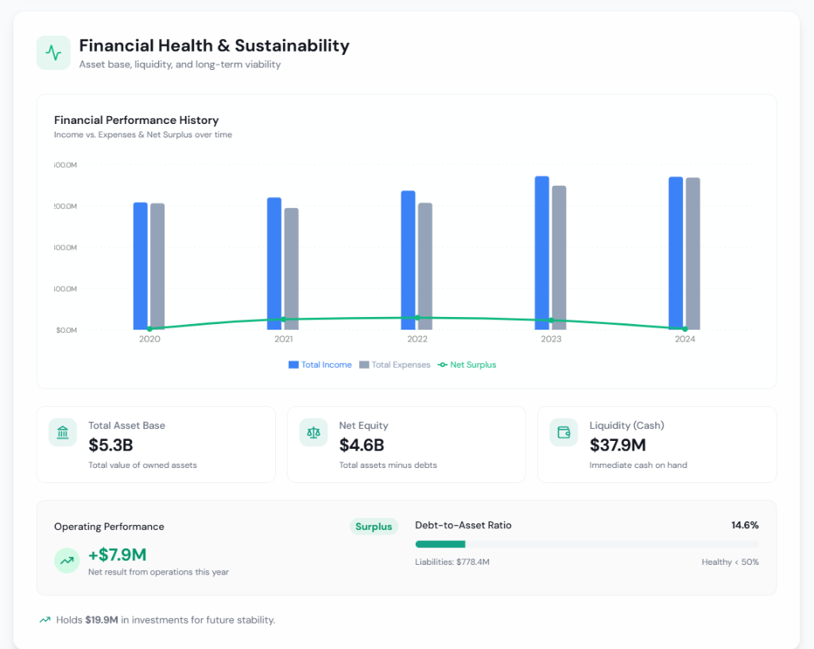
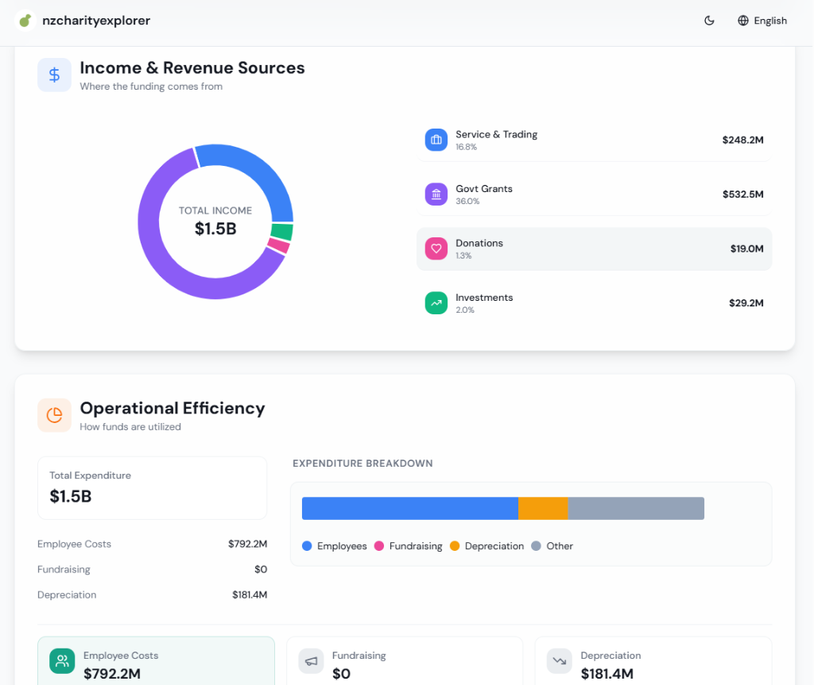
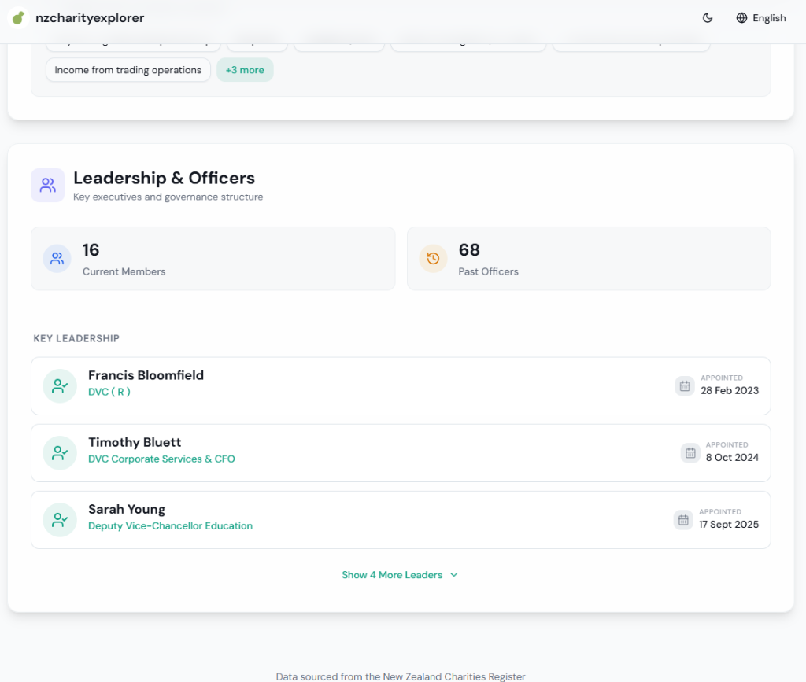

# nzcharityexplorer

**Making New Zealand Charity Data Accessible and Transparent**

Welcome to **nzcharityexplorer**, a user-friendly tool designed to help you understand the financial health and operations of charities across New Zealand.

## What is this?
nzcharityexplorer is a website that takes complex financial data from the official **New Zealand Charities Register** and turns it into easy-to-read charts, graphs, and summaries. 

Typically, finding out how a charity spends its money requires digging through long, complicated PDF reports. I believe that transparency should be easy. With this tool, you can instantly see where a charity's money comes from and where it goes.

## Why use it?
- **For Donors:** Make sure your donation is going to a healthy, well-managed organization that aligns with your values.
- **For Researchers & Journalists:** Quickly gather stats and facts about the charitable sector.
- **For Charities:** See how your organization compares to others and present your data in a clear way to your supporters.

## Key Features
- **Search:** Find any registered charity in New Zealand by name or registration number.
- **Financial Health Check:** unexpected deficits or massive surpluses are highlighted instantly.
- **Income & Spending Breakdown:** See exactly how much comes from government grants, donations, or trading, and how much is spent on salaries vs. actual services.
- **Executive Team:** View who is running the charity and their roles.
- **Mobile Friendly:** Check charity stats on the go, right from your phone.

## Project Showcase

### Landing Page
Get a quick overview of the charitable sector.

### Charity Rankings
Compare charities by revenue, assets, and more.

### Charity Details
See detailed mission statements and summaries.

### Financial Health
Visualize income, expenses, and stability over time.

### Operational Transparency
Understand exactly where funding comes from and how it is used.

### Leadership & Officers
View key executives and governance structure.

## How it Works
We connect directly to the public database provided by the **Charities Services (Department of Internal Affairs)**. We do not alter the data; we simply present it in a format that makes sense to everyone, not just accountants.

## Feedback and Ideas
If you have ideas, feedback, or want to contribute:

- **Join our Discord**: [https://discord.gg/r4fwAJC4pu](https://discord.gg/r4fwAJC4pu)

---
*Note: This project is not affiliated with the NZ Charities Services. All data is sourced from public records.*
